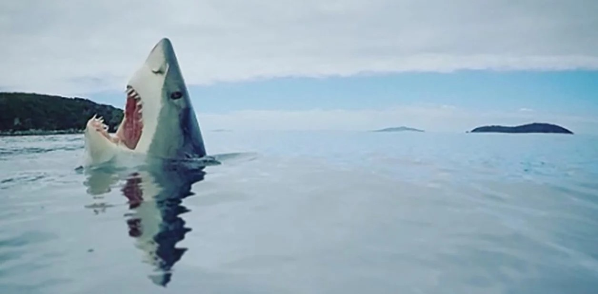
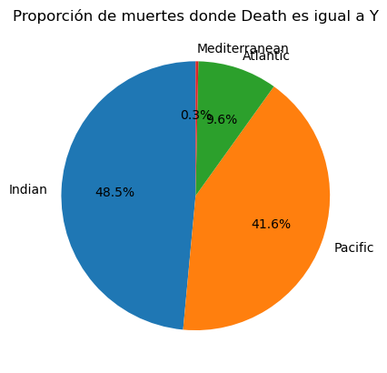
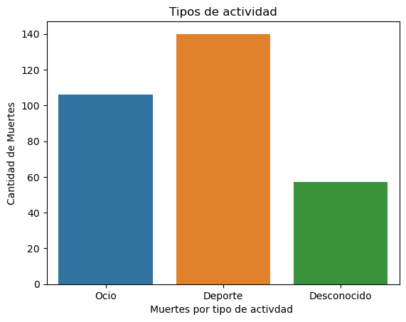

## Proyecto Tiburoncin

## Objetivo 

En este primer proyecto, el principal objetivo es limpiar una base de datos para que la misma pueda ser analizada en un futuro. 
La base de datos utilizada es la siguiente: [Global Shark Attacks](https://www.kaggle.com/datasets/teajay/global-shark-attacks).

Para empezar a limpiar la base, mi objetivo se basó en obtener la cantidad de muertes por océano causada por ataques de tiburones. 
Es así que decidí eliminar datos irrelevantes y no fiables para obtener un resultado adecuado.

Ya con la base filtrada y limpia, decidi crear otra columna para analizar la cantidad de muertes segun la activdad que se realiza. Separe los tipos de actividad en tres grupos: deporte, ocio y desconocido.

## Conclusiones Finales

Analizando las tablas y graficos del dataframe, se puede ver claramente la proporicon de ataques por oceano que terminan en muerte. Siendo en algunos oceanos mas shockeante los porcentajes de muertes, como dentro del oceano pacifico y el Indico.

Mientras que para el analisis de muertes por tipo de actividad realizada, vemos la mayoria de las muertes ocurren en el ambito del deporte acuatico.

## Graficos para demostrar las conclusiones

 

